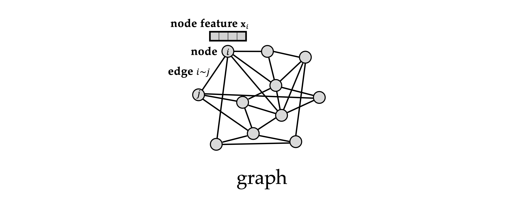
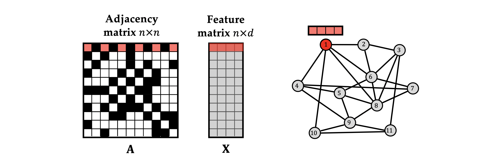

# Introduction

Graphs are probably the most versatile and the most **important construction** when we refer to representation. They are astonishly ubiquitous. We can **describe** practically any **system** of **relations** or interactions as a **graph**. This is true at **nano scales** where we can model individual molecules, to **micro scale** where we can look at different interactions between biological entities like molecules, drugs and proteins modelled in **interactomes**, to finally concluding at **macro scale** by modelling social graphs of people.

# Idea 

**Conceptualization**: When we think of a graph, we think about a system of **relations** and **interactions** between its **elements**.

A **graph** is a collection of *[vertices](https://ncatlab.org/nlab/show/vertices)* and *[edges](https://ncatlab.org/nlab/show/edges)*, each [edge](https://ncatlab.org/nlab/show/edge) links a pair of [vertices](https://ncatlab.org/nlab/show/vertices), defining a relationship of *incidence* between vertices and edges. There are several variations on the idea.

## Definition

Let $$V$$ and $$E$$ be sets. Call an element of $$V$$ a **vertex** and a element of $$E$$ an **edge**. A **graph** is given by $$V, E$$, and a mapping $$d$$ that interprets edges as pairs of vertices. Exactly what this means depends on how one defines "mapping that interprets" and "pair". The possibilities are given below. We will need the following notation:

- $$V^{2}$$ is the [cartesian product](https://ncatlab.org/nlab/show/cartesian+product) of $$V$$ with itself, the sed of ordered pairs $$(x,y)$$ of vertices.
- $$\Delta_{V}$$ is the [diagonal subset](https://ncatlab.org/nlab/show/diagonal+subset) of $$V$$, the set of pairs $$(x,x)$$, so that its **complement** $$V^2 \setminus \Delta_V$$ is the set of pairs as above where $$x \neq y$$. 
- $$\left\langle{V \atop 2}\right\rangle$$ is the [quotient set](https://ncatlab.org/nlab/show/quotient+set) of $$V^{2}$$ in which $$(x,y)$$ is identified with $$(y,x)$$, the set of **unordered** pairs $${x,y}$$ of vertices.

This brings us with the following types of graphs according to their **ordering**:
1. **Undirected graphs**
2. **Directed graphs**
3. **Undirected graphs as directed graphs with an involution**

We can also **attach** some **features** to the **nodes** that will be modeled as **d-dimensional** vectors. For example, in a social network graph, each node might contain information relative to the user of the node such as age, height, sex...
For the sake of simplicity we are going to ignore possible features linked to edges, but they could exist.

# Key Structural Properties of Graphs

The key structure of a graph or a set is that it's **unordered**. We don't have a canonical way to order its nodes. Thus when we number the nodes of an graph, for example the above one, we are partially **cheating**.
It's **convenient** because we can now **organize** the nodes features into a matrix of dimensions $$n \times d$$, where **n** is the number of nodes and **d** the dimension of the features. This way we can automatically prescribe some **arbitrary** ordering and apply it for the **adjacency matrix**.

The adjacency matrix for a graph with $$n$$ vertices is an $$n \times n$$ matrix whose $$(i,j)$$ entry is $$1$$ if the vertex $$i^{th}$$ and vertex $$j^{th}$$ are **connected**, and $$0$$ if they are not.

The representation of the adjacency matrix depends on the selected ordering to the set of nodes.

# References

1. [nLab: Graph](https://ncatlab.org/nlab/show/graph)
