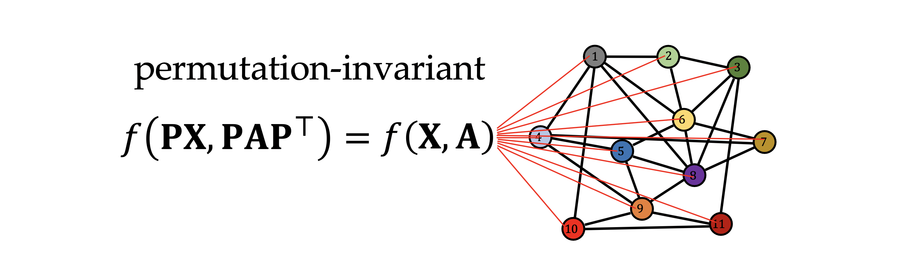
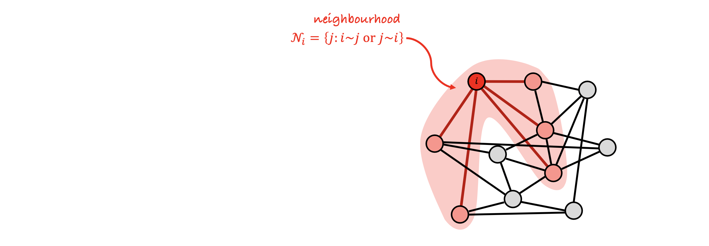
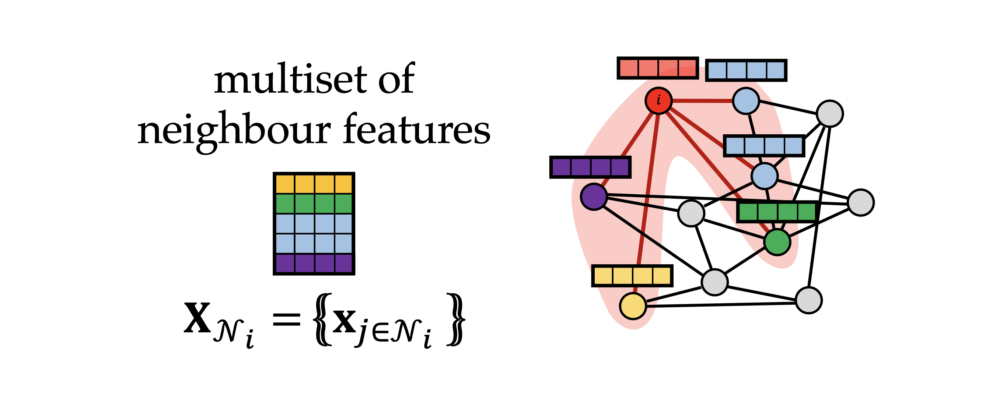
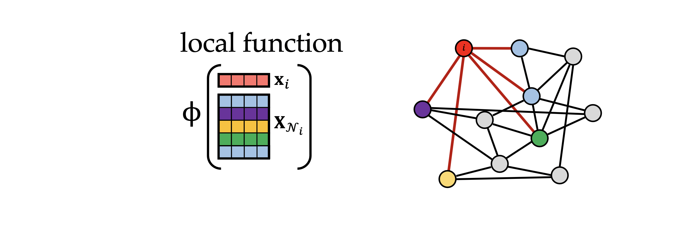
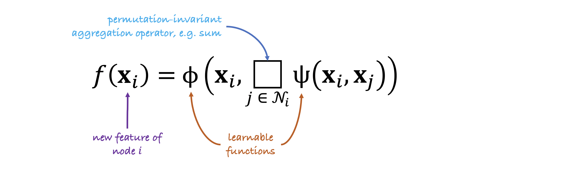

# Introduction

Graphs are probably the most versatile and the most **important construction** when we refer to representation. They are astonishly ubiquitous. We can **describe** practically any **system** of **relations** or interactions as a **graph**. This is true at **nano scales** where we can model individual molecules, to **micro scale** where we can look at different interactions between biological entities like molecules, drugs and proteins modelled in **interactomes**, to finally concluding at **macro scale** by modelling social graphs of people.

# 1. Idea 

**Conceptualization**: When we think of a graph, we think about a system of **relations** and **interactions** between its **elements**.

A **graph** is a collection of *[vertices](https://ncatlab.org/nlab/show/vertices)* and *[edges](https://ncatlab.org/nlab/show/edges)*, each [edge](https://ncatlab.org/nlab/show/edge) links a pair of [vertices](https://ncatlab.org/nlab/show/vertices), defining a relationship of *incidence* between vertices and edges. There are several variations on the idea.

# 2. Definition

Let $$V$$ and $$E$$ be sets. Call an element of $$V$$ a **vertex** and a element of $$E$$ an **edge**. A **graph** is given by $$V, E$$, and a mapping $$d$$ that interprets edges as pairs of vertices. Exactly what this means depends on how one defines "mapping that interprets" and "pair". The possibilities are given below. We will need the following notation:

- $$V^{2}$$ is the [cartesian product](https://ncatlab.org/nlab/show/cartesian+product) of $$V$$ with itself, the sed of ordered pairs $$(x,y)$$ of vertices.
- $$\Delta_{V}$$ is the [diagonal subset](https://ncatlab.org/nlab/show/diagonal+subset) of $$V$$, the set of pairs $$(x,x)$$, so that its **complement** $$V^2 \setminus \Delta_V$$ is the set of pairs as above where $$x \neq y$$. 
- $$\left\langle{V \atop 2}\right\rangle$$ is the [quotient set](https://ncatlab.org/nlab/show/quotient+set) of $$V^{2}$$ in which $$(x,y)$$ is identified with $$(y,x)$$, the set of **unordered** pairs $${x,y}$$ of vertices.

This brings us with the following types of graphs according to their **ordering**:
1. **Undirected graphs**
2. **Directed graphs**
3. **Undirected graphs as directed graphs with an involution**

We can also **attach** some **features** to the **nodes** that will be modeled as **d-dimensional** vectors. For example, in a social network graph, each node might contain information relative to the user of the node such as age, height, sex...
For the sake of simplicity we are going to ignore possible features linked to edges, but they could exist.

# 3. History of Graph Neural Networks

|                      |                                  |                                          |                              |                               |
| :------------------: | :------------------------------: | :--------------------------------------: | :--------------------------: | :---------------------------: |
| **Machine Learners** |       Labeling RAAM (1994)       | Backpropagation through structure (1996) | Graph Neural Networks (2008) |       Gated GNN (2015)        |
| **Graph Theorists**  | Weisfeiler-Lehman kernels (2009) |                  k-GNN                   |          GIN (2019)          |     Provably powerful GNN     |
|     **Chemists**     |          ChemNet (1995)          |        Neural descriptors (1997)         |  Molecular graph net (2005)  | Molecular fingerprints (2017) |

The term **graph neural networks** first appeared in a series of papers by the group of research conformed by **M. Gore** and **F. Scarselli**. But graph theory research argue that graph neural networks are just a **rebranding** of a graph **isomorphism test** called the **Weisfeiler-Lehman test** (1968). This test address a classical graph theory problem that tries to determine if **2** graphs are **isomorphic** or have the **same** connectivity up to **reordering** the nodes.

***NOTE***: Nowadays there isn't any algorithm that can compute and solve the Weisfeiler-Lehman Test in polynomial time. Only solvable in polynomial time up to graphs with **9** nodes. Indeed this problem was proved to have a computational solution in quasi-polynomial 

# 4. Key Structural Properties of Graphs

The key structure of a graph or a set is that it's **unordered**. We don't have a canonical way to order its nodes. Thus when we number the nodes of an graph, for example the above one, we are partially **cheating**.
It's **convenient** because we can now **organize** the nodes features into a matrix of dimensions $$n \times d$$, where **n** is the number of nodes and **d** the dimension of the features. This way we can automatically prescribe some **arbitrary** ordering and apply it for the **adjacency matrix**.

The adjacency matrix for a graph with $$n$$ vertices is an $$n \times n$$ matrix whose $$(i,j)$$ entry is $$1$$ if the vertex $$i^{th}$$ and vertex $$j^{th}$$ are **connected**, and $$0$$ if they are not.

The representation of the adjacency matrix depends on the selected ordering to the set of nodes.

**Conclusion**: If we number the nodes differently implies that the **rows** of the **feature matrix** and corresponding rows and columns of the adjacency matrix will be **permuted** accordingly. We denote this **permutation matrix** by $$P$$, and $$P$$ is an **elemen** of the **permutation group** of $$n$$ elements. The permuation group contains $$n!$$ elements.
We can think of $$P$$ as a **representation** of the **permutation group**.

***NOTE***: The representation differs with respect to the type of the object. The permutation group acts differently on **vectors** and **matrices**.

## 4.2 Invariant Graph Functions: Permutation-invariant

**Strong precondition needed**: In order to implement a **function** acting on a **graph** that produces a **single output** for the **entire** graph, it's **mandatory** to assert that this single value generated output is **unaffected** by the chosen **ordering** of the **input nodes**. Independently of the ordering of the nodes, the computed output for the same graph must be always the same, although the nodes were or not rearranged.

## 4.3 Equivariant Graph Functions

In this scenario it's convenient that the output of the function changes harmoniously to the fluctuations in the input with the reordering of the nodes. 
$$
F(PX,PAP^{\top})= PF(X,A)
$$

# 5. Construct Graphs Functions

## 5.1 Multiset

### Idea
A multiset is like a [set](https://ncatlab.org/nlab/show/set), just **allowing** that the elements have **multiplicities**. Thus the multiset $$\{ 1,1,2\}$$ differs from the multiset $$\{1,2\}$$, while $$\{1,1,2\}$$ is the same as $$\{ 1,1,2\}$$. (_See ref_ $$[4]$$)

### Definition

It is common to define them in terms of **sets** and **functions**.

A $$multiset \: \mathcal{X} = \langle X,\mu_X\rangle$$, can be defined as a set $$X$$ together with a function $$\mu_{X}$$ (giving each element its **multiplicity**) from $$X$$ to a class of nonzero [cardinal numbers](https://ncatlab.org/nlab/show/cardinal+numbers).

## 5.2 Local Aggregation and Message Passing

This is the main **operation** of a classical **G**raph **N**eural **N**etwork architecture.

Question: **How this operation works?**
Answer: For each **node** in the graph we look at the **neighbors** and take the **feature vectors** that together conforms the **multiset**. Even though the **indices** of the neighbors are **unique**, the feature vectors are not necessarily unique.

**NOTE**: In this example, we have the **blue** feature **repeated** twice. Two nodes have the same feature vector. In this scenario we dealing with a **multiset**. (_See section [5.1 Multiset](#5.1-Multiset)_)

Now we try to aggregate these features together with the feature vector of the node itself. It **must** be done in a **permutation invariant** way because we don't have a canonical **ordering** of the neighbors on a graph.

$$
\Phi \Big (X_{i}, X_{\mathcal{N_i}} \Big)
$$

If we apply this $$\Phi$$ local function at every node of the graph and **stack** the results into a **feature matrix**, denoted by $$F$$, we get a **permutation equivariant** function. Thus if we **reorder** the nodes then the **order** of the **rows** of this matrix will be changed.

This local aggregation function on GNN typically looks as follows:

- $$\textcolor{SkyBlue}{permutation \: invariant \: aggregation \: operator, \: e.g. \: sum}$$: It is often **sum** or **maximal**.
- $$\textcolor{YellowOrange}{learnable \:functions} \: \Psi$$: This function transforms the neighbors features. 
- $$\textcolor{DarkOrchid}{new \: feature \: of \: node \: i} \: \phi $$: Updates the features of node $$i$$ using the aggregated features of the neighbors. It's a **non linear** function that depends on both **feature vectors** of node $$i$$ and $$j$$. Its **output** can be seen as a **message** that is sent from node $$j$$ to update node $$i$$. That's why this architecture is also called **message passing graph neural networks**.

# References

1. [nLab: graph](https://ncatlab.org/nlab/show/graph)
2. [Geometric Deep Learning: Grids, Groups, Graphs, Geodesics, and Gauges](https://arxiv.org/abs/2104.13478)
3. [Michael Bronstein's Youtube channel](https://www.youtube.com/c/MichaelBronsteinGDL/videos)
4. [multiset](https://ncatlab.org/nlab/show/multiset)
