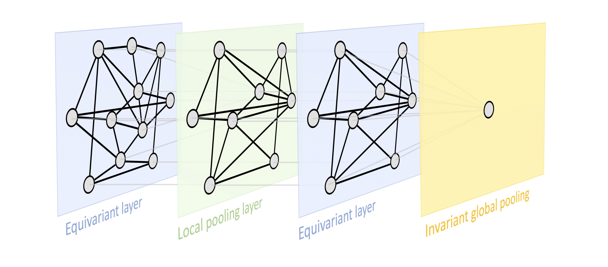

# Purpose

On **graphs** and **sets** study:

- Permuation invariant
- Permutation equivariant

**Guiding principles** to synthesise and steer the **design** of deep learning architectures:

1. **Symmetries**
2. $$\boldsymbol{\mathfrak{G}}$$-**Invariance**
3. $$\boldsymbol{\mathfrak{G}}$$-**Equivariance**
4. **Locality**
5. **Scale Separation**

# The Building Blocks of Geometric Deep Learning

The following statements encapsulate and sum up the general geometric deep learning framework.

Let $$\Omega$$ and $$\Omega'$$ be domains,  $$\boldsymbol{\mathfrak{G}}$$ a symmetry group over $$\Omega$$. Write $$\Omega' \subseteq \Omega$$ can be considered a compact version of $$\Omega$$

We define the following building blocks:

**Linear** $$\boldsymbol{\mathfrak{G}}$$-**equivariant layer** $$B: \mathcal{X}(\Omega,\mathcal{C}) \to \mathcal{X}(\Omega', \mathcal{C'})$$, satisfying linearity and resistance to group action in an equivariant way. No matter which symmetry group transformation $$\boldsymbol{\mathfrak{g}}$$ we take and featurization function $$x$$.
$$
B(\boldsymbol{\mathfrak{g}}.x) = \boldsymbol{\mathfrak{g}}.B(x) \forall \boldsymbol{\mathfrak{g}} \in \boldsymbol{\mathfrak{G}} \: and \: x \in \mathcal{X}(\Omega,\mathcal{C})
$$
**Nonlinearity** $$\sigma: \mathcal{C} \to \mathcal{C'}$$ Applied element-wise as
$$
\big ( \boldsymbol{\sigma}(x) \big)(u) = \sigma(x(u))
$$
In deep learning we typically inject nonlinearities through usage point-wise nonlinearities such as **sigmoid functions**, tangent or ReLU.

When we compose linear $$\boldsymbol{\mathfrak{g}}$$ equivariant layers and nonlinearities, we will end up with universal approximators over the domains.

**Local pooling** (coarsening)
$$
P: \mathcal{X}(\Omega, \mathcal{C}) \to \mathcal{X}(\Omega', \mathcal{C})
$$
such that $$\Omega' \subseteq \Omega$$.

Coarsening: Sometimes it might be useful to **coarse** the domain. This means going from an initial $$\Omega$$ to an $$\Omega'$$ which is slightly **smaller** and contains the previous domain within it.

$$\boldsymbol{\mathfrak{G}}$$-**invariant layer** (global pooling) $$A: \mathcal{X}(\Omega,\mathcal{C}) \to \mathcal{y}$$, satisfying 
$$
A(\boldsymbol{\mathfrak{g}}.x) = A(x) \forall \boldsymbol{\mathfrak{g}} \in \boldsymbol{\mathfrak{G}} \: and \: x \in \mathcal{X}(\Omega, \mathcal{C})
$$
If we need **answers** on the level of the entire **domain**, we can use a global pooling layer which is **invariant** to the **symmetry** group transformation.

# GDL Framework in action: Graphs & Sets

## Motivation

We are going to start by demonstrating the blueprint on graphs because graphs and sets give us a very nice **discrete domain** with **minimal geometric assumptions** easy to analyse.

Also with some assumptions and transformations, any domain can be seen as a graph.

Question: **Why we might want to study data that lives on graphs?**

Answer: Graphs are common structures around us mostly all the time. They can be thought of as sort of the **main** modality of data we can encounter from **nature**.

_e.g._:

- Molecular graphs
- Transportation networks
- Social networks

> “_The image of the world around us, which we carry in our head, is just a *model*. Nobody in his head imagines all the world, government or country. He has only selected ***concepts***, and ***relationships*** between them, and uses those to represent the real system._” **Jay Wright Forrester 1971**

## Sets: Graphs Without Connections

### Why?

1. Graphs without connections, called **unordered sets**, have only **nodes** and no connections between them. This structure construct a simpler **domain**, so it's going to be much easier to analyse the geometric architectures that arise. 
2. A significant part of the conclusions we achieve from sets will naturally carry over to graphs.
3. Even if we restrict ourselves completely to processing data on sets following this kind of structure, it would still a relevant area. _e.g_: **point clouds** data

### Learning On Sets: Setup

Assume our graph **has no edges**
$$
\textcolor{Red}{\Omega} = \mathcal{V}
$$
, the set of nodes.

We typically want to deal with **featurizing** this domain in some way. Thus we will assume that node $$i$$ has **features** $$x_{i} \in \R^{k}$$, which is a real value **vector** with **k-dimensional** features This corresponds to our **feature space** $$\mathcal{C}$$. 

Our feature space then is
$$
\textcolor{Red}{\mathcal{C}} = \R^{k}
$$
Once we have these features a typical way in which we can process data like this is by **stacking** the **node features** into a **node feature matrix** $$\boldsymbol{X}$$.
$$
\boldsymbol{X} = (\boldsymbol{x_{1}},...,\boldsymbol{x_{n}})^{\top}
$$
This feature matrix $$\boldsymbol{X}$$ of shape $$|\mathcal{V}| \times k$$, is interpreted such as **row** $$i$$ corresponds to the **features** of the $$ith$$ **node**.

**NOTE**: At the time we are building this feature matrix we have already **introduced** some notion of **order**. Thus we break apart our strong and initial **assumption**, when we assume the sets to be completely unordered. We would like a neural network that operates on $$\boldsymbol{X}$$ which **not depends** on the **order** of the **rows** of $$\boldsymbol{X}$$.

_e.g_:

Given an unordered set of **five nodes** and their features being $$\{ x_1, x_2, x_3, x_4, x_5\}$$, we are asked to learn some class of functions, neural networks, that will take the features of these individual nodes and produce an output on the level of the entire set. This function $$f$$ is desired to be **resistant** to the **order** in which we fed these features.
$$
f(\{ x_1, x_2, x_3, x_4, x_5\}) = y = \{x_2, x_5, x_4, x_3, x_1\}
$$
**Conclusion**: Even if we completely perturb the order in which we give the set elements to the function $$f$$ we expect the output $$y$$ to be unaffected. In the framework of **GDL** this corresponds to using the **n-element Permutation group** $$\Sigma_{n}$$ as our **symmetry group** $$\boldsymbol{\mathfrak{G}}$$. The different group elements within this symmetry group will be the **permutations**
$$
\boldsymbol{\mathfrak{g}} \in \boldsymbol{\mathfrak{G}}
$$
The permutation will change the order in which we see the elements in this set and we want our neural networks to be resistant to this phenomenon.

### Permutations and Permutations Matrices

#### Idea

A permutation on a set $$S$$ is equivalently

1. a [bijection](https://ncatlab.org/nlab/show/bijection), **one-to-one correspondence**, from $$S$$ to itself,

2. a [pair](https://ncatlab.org/nlab/show/pair) of [linear orderings](https://ncatlab.org/nlab/show/linear+orderings) on $$S$$,

A **linear order** on a set $$S$$ is a binary **relation** $$<$$ with the following properties:

- [irreflexivity](https://ncatlab.org/nlab/show/irreflexive+relation): $$x \nless x$$,
- [asymmetry](https://ncatlab.org/nlab/show/asymmetric+relation): if $$x < y$$, then $$y \nless x$$,
- [transitivity](https://ncatlab.org/nlab/show/transitive+relation): if $$x < y < z$$, then $$x < z$$,
- [comparison](https://ncatlab.org/nlab/show/comparison): if $$x < z$$, then $$x < y$$ or $$y < z$$,
- [connectedness](https://ncatlab.org/nlab/show/connected+relation): if $$x \nless y$$ and $$y \nless x$$, then $$x = y$$.

3. an element in the [symmetric group](https://ncatlab.org/nlab/show/symmetric+group) of $$\boldsymbol{\mathfrak{G}}$$.

As automorphisms $$\sigma: S \to S$$ in set, the permutations of $$X$$ naturally form a **group** under **composition**, called the **symmetric group** (or **permutation group**) on $$S$$. This group may be denoted by $$S_{X}, \Sigma_{X}, X!$$, but we are going to denote it by $$\boldsymbol{\mathfrak{G}}$$. When $$S$$ is an finite set $$(n) = \{ 1,...,n\}$$, then its symmetric group is a **finite group** of [cardinality](https://ncatlab.org/nlab/show/cardinality) $$n!$$. This is typically written as $$\Sigma_n$$.