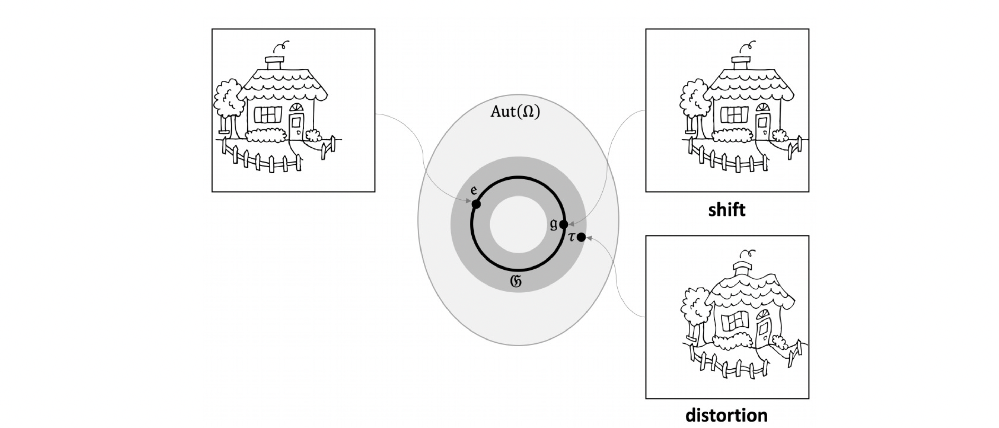
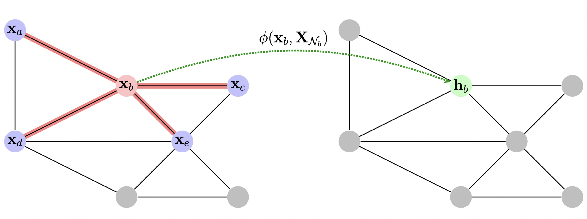
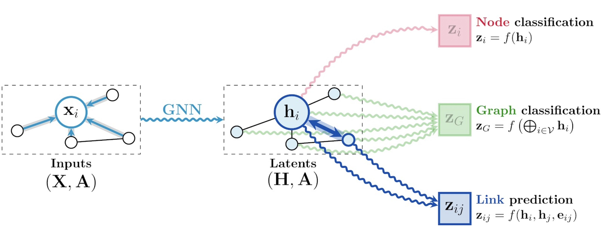

# Purpose

On **graphs** and **sets** study:

- Permuation invariant
- Permutation equivariant

**Guiding principles** to synthesise and steer the **design** of deep learning architectures:

1. **Symmetries**
2. $$\boldsymbol{\mathfrak{G}}$$-**Invariance**
3. $$\boldsymbol{\mathfrak{G}}$$-**Equivariance**
4. **Locality**
5. **Scale Separation**

# The Building Blocks of Geometric Deep Learning

The following statements encapsulate and sum up the general geometric deep learning framework.

Let $$\Omega$$ and $$\Omega'$$ be domains,  $$\boldsymbol{\mathfrak{G}}$$ a symmetry group over $$\Omega$$. Write $$\Omega' \subseteq \Omega$$ can be considered a compact version of $$\Omega$$

We define the following building blocks:

**Linear** $$\boldsymbol{\mathfrak{G}}$$-**equivariant layer** $$B: \mathcal{X}(\Omega,\mathcal{C}) \to \mathcal{X}(\Omega', \mathcal{C'})$$, satisfying linearity and resistance to group action in an equivariant way. No matter which symmetry group transformation $$\boldsymbol{\mathfrak{g}}$$ we take and featurization function $$x$$.
$$
B(\boldsymbol{\mathfrak{g}}.x) = \boldsymbol{\mathfrak{g}}.B(x) \forall \boldsymbol{\mathfrak{g}} \in \boldsymbol{\mathfrak{G}} \: and \: x \in \mathcal{X}(\Omega,\mathcal{C})
$$
**Nonlinearity** $$\sigma: \mathcal{C} \to \mathcal{C'}$$ Applied element-wise as
$$
\big ( \boldsymbol{\sigma}(x) \big)(u) = \sigma(x(u))
$$
In deep learning we typically inject nonlinearities through usage point-wise nonlinearities such as **sigmoid functions**, tangent or ReLU.

When we compose linear $$\boldsymbol{\mathfrak{g}}$$ equivariant layers and nonlinearities, we will end up with universal approximators over the domains.

**Local pooling** (coarsening)
$$
P: \mathcal{X}(\Omega, \mathcal{C}) \to \mathcal{X}(\Omega', \mathcal{C})
$$
such that $$\Omega' \subseteq \Omega$$.

Coarsening: Sometimes it might be useful to **coarse** the domain. This means going from an initial $$\Omega$$ to an $$\Omega'$$ which is slightly **smaller** and contains the previous domain within it.

$$\boldsymbol{\mathfrak{G}}$$-**invariant layer** (global pooling) $$A: \mathcal{X}(\Omega,\mathcal{C}) \to \mathcal{y}$$, satisfying 
$$
A(\boldsymbol{\mathfrak{g}}.x) = A(x) \forall \boldsymbol{\mathfrak{g}} \in \boldsymbol{\mathfrak{G}} \: and \: x \in \mathcal{X}(\Omega, \mathcal{C})
$$
If we need **answers** on the level of the entire **domain**, we can use a global pooling layer which is **invariant** to the **symmetry** group transformation.

# GDL Framework in action: Graphs & Sets

## Motivation

We are going to start by demonstrating the blueprint on graphs because graphs and sets give us a very nice **discrete domain** with **minimal geometric assumptions** easy to analyse.

Also with some assumptions and transformations, any domain can be seen as a graph.

Question: **Why we might want to study data that lives on graphs?**

Answer: Graphs are common structures around us mostly all the time. They can be thought of as sort of the **main** modality of data we can encounter from **nature**.

_e.g._:

- Molecular graphs
- Transportation networks
- Social networks

> “_The image of the world around us, which we carry in our head, is just a *model*. Nobody in his head imagines all the world, government or country. He has only selected ***concepts***, and ***relationships*** between them, and uses those to represent the real system._” **Jay Wright Forrester 1971**

## Learning On Sets: Graphs Without Connections

### Why?

1. Graphs without connections, called **unordered sets**, have only **nodes** and no connections between them. This structure construct a simpler **domain**, so it's going to be much easier to analyse the geometric architectures that arise. 
2. A significant part of the conclusions we achieve from sets will naturally carry over to graphs.
3. Even if we restrict ourselves completely to processing data on sets following this kind of structure, it would still a relevant area. _e.g_: **point clouds** data

#### Setup

Assume our graph **has no edges**
$$
\textcolor{Red}{\Omega} = \mathcal{V} \\
E = \empty
$$
, the set of nodes.

We typically want to deal with **featurizing** this domain in some way. Thus we will assume that node $$i$$ has **features** $$x_{i} \in \R^{k}$$, which is a real value **vector** with **k-dimensional** features This corresponds to our **feature space** $$\mathcal{C}$$. 

Our feature space then is
$$
\textcolor{Red}{\mathcal{C}} = \R^{k}
$$
Once we have these features a typical way in which we can process data like this is by **stacking** the **node features** into a **node feature matrix** $$\boldsymbol{X}$$.
$$
\boldsymbol{X} = (\boldsymbol{x_{1}},...,\boldsymbol{x_{n}})^{\top}
$$
This feature matrix $$\boldsymbol{X}$$ of shape $$|\mathcal{V}| \times k$$, is interpreted such as **row** $$i$$ corresponds to the **features** of the $$ith$$ **node**.

**NOTE**: At the time we are building this feature matrix we have already **introduced** some notion of **order**. Thus we break apart our strong and initial **assumption**, when we assume the sets to be completely unordered. We would like a neural network that operates on $$\boldsymbol{X}$$ which **not depends** on the **order** of the **rows** of $$\boldsymbol{X}$$.

_e.g_:

Given an unordered set of **five nodes** and their features being $$\{ x_1, x_2, x_3, x_4, x_5\}$$, we are asked to learn some class of functions, neural networks, that will take the features of these individual nodes and produce an output on the level of the entire set. This function $$f$$ is desired to be **resistant** to the **order** in which we fed these features.
$$
f(\{ x_1, x_2, x_3, x_4, x_5\}) = y = f(\{x_2, x_5, x_4, x_3, x_1\})
$$
**Conclusion**: Even if we completely perturb the order in which we give the set elements to the function $$f$$ we expect the output $$y$$ to be unaffected. In the <u>framework of **GDL**</u> this corresponds to using the **n-element Permutation group** $$\Sigma_{n}$$ as our **symmetry group** $$\boldsymbol{\mathfrak{G}}$$. The different group elements within this symmetry group will be the **permutations**
$$
\boldsymbol{\mathfrak{g}} \in \boldsymbol{\mathfrak{G}}
$$
The permutation will change the order in which we see the elements in this set and we want our neural networks to be resistant to this phenomenon.

### Permutations and Permutations Matrices

#### Idea

It's useful to think about operators that **change** the node order.

_e.g_: $$(1,2,3,4) \rightarrow (2,4,1,3)$$

This example permutation maps the following actions over the set:

- $$y_1 \leftarrow x_2$$
- $$y_2 \leftarrow x_4$$
- $$y_3 \leftarrow x_1$$
- $$y_4 \leftarrow x_3$$

Concretised in the form of a unique expression as:
$$
\boldsymbol{\mathfrak{g}} = (\array{1 \mapsto 3 & 2 \mapsto 1 & 3 \mapsto 4 & 4 \mapsto})
$$

Formally, a permutation on a set $$S$$ is equivalently

1. a [bijection](https://ncatlab.org/nlab/show/bijection), **one-to-one correspondence**, from $$S$$ to itself,

2. a [pair](https://ncatlab.org/nlab/show/pair) of [linear orderings](https://ncatlab.org/nlab/show/linear+orderings) on $$S$$,

A **linear order** on a set $$S$$ is a binary **relation** $$<$$ with the following properties:

- [irreflexivity](https://ncatlab.org/nlab/show/irreflexive+relation): $$x \nless x$$,
- [asymmetry](https://ncatlab.org/nlab/show/asymmetric+relation): if $$x < y$$, then $$y \nless x$$,
- [transitivity](https://ncatlab.org/nlab/show/transitive+relation): if $$x < y < z$$, then $$x < z$$,
- [comparison](https://ncatlab.org/nlab/show/comparison): if $$x < z$$, then $$x < y$$ or $$y < z$$,
- [connectedness](https://ncatlab.org/nlab/show/connected+relation): if $$x \nless y$$ and $$y \nless x$$, then $$x = y$$.

3. an element in the [symmetric group](https://ncatlab.org/nlab/show/symmetric+group) of $$\boldsymbol{\mathfrak{G}}$$.

As automorphisms $$\sigma: S \to S$$ in set, the permutations of $$X$$ naturally form a **group** under **composition**, called the **symmetric group** (or **permutation group**) on $$S$$. This group may be denoted by $$S_{X}, \Sigma_{X}, X!$$, but we are going to denote it by $$\boldsymbol{\mathfrak{G}}$$. When $$S$$ is an finite set $$(n) = \{ 1,...,n\}$$, then its symmetric group is a **finite group** of [cardinality](https://ncatlab.org/nlab/show/cardinality) $$n!$$. This is typically written as $$\Sigma_n$$.

Within **linear algebra**, each permutation defines a $$|\mathcal{V}| \times |\mathcal{V}|$$ **matrix** ($$n \times n$$).

Such matrices, called **permutation matrices** (group action $$\rho(\boldsymbol{\mathfrak{g}})$$), have **zeros** almost everywhere and have strictly just a **one** in every **row** and **column**. The positions of these ones correspond to the order of the nodes in the permutation.

_e.g_: For our initial example
$$
\boldsymbol{X}=
\begin{bmatrix}
\boldsymbol{x_1} \\
\boldsymbol{x_2} \\
\boldsymbol{x_3} \\
\boldsymbol{x_4} \\
\end{bmatrix}
$$

the permutation matrix looks as follows:
$$
\boldsymbol{P}_{(2,4,1,3)} =
\begin{bmatrix}
0 & 1 & 0 & 0 \\
0 & 0 & 0 & 1 \\
1 & 0 & 0 & 0 \\
0 & 0 & 1 & 0 \\
\end{bmatrix}
$$
Its effect when **left-multiplied** is to permute rows of $$\boldsymbol{X}$$ as follows
$$
\boldsymbol{P}\boldsymbol{X} = \begin{bmatrix}
\boldsymbol{x_2} \\
\boldsymbol{x_4} \\
\boldsymbol{x_1} \\
\boldsymbol{x_3} \\
\end{bmatrix}
$$

**Conclusion**: This examples illustrates that the permutation matrix is exactly the representation of the **group action** of the of the **permutation group**. Thus we can use this **matrix representation** to reason about permutations while being in the universe of **linear algebra**, which is going to make all of the subsequent analysis a lot easier.

### Permutation invariance

We want functions $$f(\boldsymbol{X})$$ that operate over sets node features, that will **NOT** depend on the **order** of the nodes. Equivalently if we apply a permutation matrix to $$\boldsymbol{X}$$, it **shouldn't change** the **result**. Thus $$f(\boldsymbol{X})$$ is permutation invariant if and only, for **all** permutation matrices $$\boldsymbol{P}$$:
$$
f(\boldsymbol{PX}) = f(\boldsymbol{X})
$$
This property is desirable for set neural networks when we **assume** that our domain is **unordered** sets. We then say that the set neural network $$f(\boldsymbol{X})$$ is permutation invariant if and only if independently of the chosen $$\boldsymbol{X}$$ matrix chosen, the result stills **unchanged**.

We can compare this with our requirement in the <u>geometric deep learning framework</u> for $$\boldsymbol{\mathfrak{G}}$$-**invariant layer**, and specifically in this case, our $$f$$ corresponds to the $$\boldsymbol{\mathfrak{G}}$$-**invariant layer** $$A$$, and the group action $$\boldsymbol{\mathfrak{g}}$$ corresponds to applying a permutation matrix. Therefore we have a **one-to-one** correspondence with the framework. 

#### Deep Sets model

It's general procedure to perform representation learning on sets in a way that's permutation invariant. It applies a **point-wise** neural network $$\psi$$ on **every** single **node** in **isolation**. Then in order to guarantee permutation invariance, we **sum** up the features of **all** the nodes in the set to finally **transform** that with neural network, denoted by $$\phi$$.
$$
f(\boldsymbol{X}) = \textcolor{Orange}{\phi \Bigg (} 
\Sigma_{i \in \mathcal{V}} 
\textcolor{Green}{\psi(} x_i \textcolor{Green}{)}
\textcolor{Orange}{\Bigg )}
$$
In this expression $$\textcolor{Orange}{\phi}$$ and $$\textcolor{Green}{\psi}$$ are **learnable** functions.

The **sum** aggregation is responsible to achieve the permutation invariance because independently of how we permute the rows of a matrix, its sum will be always be the same. Even though we can use other types of **aggregators** such as **maximization** or **average**, which indeed keep achieving permutation invariance. Thus we can **generalize** the previous expression to be
$$
f(\boldsymbol{X}) = \textcolor{Orange}{\phi \Bigg (} 
\bigoplus_{i \in \mathcal{V}} 
\textcolor{Green}{\psi(} x_i \textcolor{Green}{)}
\textcolor{Orange}{\Bigg )}
$$
Since this moment, whenever we see the generic aggregator operator, denoted by $$\bigoplus$$, we must conceive **anything** which is **permutation invariant** over its arguments.

### Permutation equivariance

Permutation invariant models are good for **set-level** outputs. This means that it's a desirable property to have when we want outputs on the level of the entire set.

Question: **What if we would like answers to node level?**

Answer: In order to preserve and identify **node outputs** we can't take use of the permutation invariant summation. Here **summation** would potentially **destroy** node-level outputs or at least make them really hard to recover.

Now rather than restrict the generated output to be resistant to permutation, we want to let the permutation produce a **new** and different **result** but while making this phenomena **predictable**. Therefore we want a function that **doesn't change** the node **order** when applied. This concludes that it doesn't matter **when** we apply the **permutation** to the set.
$$
\boldsymbol{F}(\boldsymbol{PX}) = \boldsymbol{PF}(\boldsymbol{X})
$$
***NOTE***: Trying to be consistent with the linear algebra universe and its notation, the function is capitalized and in **bold**, because it returns a **matrix** as **output**.

<u>Compare with **GDL** framework:</u>
**Linear** $$\boldsymbol{\mathfrak{G}}$$-**equivariant layer** $$B: \mathcal{X}(\Omega,\mathcal{C}) \to \mathcal{X}(\Omega', \mathcal{C'})$$, satisfying linearity and resistance to group action in an equivariant way. No matter which symmetry group transformation $$\boldsymbol{\mathfrak{g}}$$ we take and featurization function $$x$$.

### Locality

Strict resistance to symmetries is not the only property we want. It's desirable that our neural networks's **predictions** not immensely **collapse** under the effect of **non-perfect** symmetry transformation.

Data is not usually transformed using a symmetry element but rather **noise** it's acquired and added in the transformations, generating **distortions**. Then we would want the signal to be **stable** under slight **deformations** of the domain.

If we want to achieve this level of resistance under distortions, it's crucial to **compose local** operations to model **large scales** ones, as local operations **won't globally** propagate **errors**. This implies that we would want graph neural networks (GNN) to have **layers** which behave **locally** with respect to the structure of the domain.

Question: **What does it mean for an equivariant layer on sets to be local?**

Answer: One way we can enforce **locality** in equivariant set functions is through a **shared** function $$\psi$$ applied to every **node** in **isolation**:
$$
\boldsymbol{h}_{i} = \psi(\boldsymbol{x}_{i})
$$

Stacking $$\boldsymbol{h}_{i}$$ in the same way we stacked the original $$\boldsymbol{x}_{i}$$, this yields an new matrix, denoted by $$\boldsymbol{H}$$, which is considered as the output of our function $$\boldsymbol{F}$$.
$$
\boldsymbol{H} = \boldsymbol{F}(\boldsymbol{X})
$$

<u>Compare with **GDL** framework:</u>

(stacking) $$\textcolor{Cyan}{equivariant}$$ functions, potentially with an $$\textcolor{Orange}{invariant}$$ tail yields any useful set neural nets.
$$
f(\boldsymbol{X}) = \textcolor{Orange}{\phi \Bigg (} 
\bigoplus_{i \in \mathcal{V}} 
\textcolor{Green}{\psi(} x_i \textcolor{Green}{)}
\textcolor{Orange}{\Bigg )}
$$
This expression is quite close to what our framework would have construct. There is a point-wise function which corresponds precisely to a local equivariant function, denoted by $$\textcolor{Green}{\psi}$$, over **nodes**, and then if needed to generate predictions at **set-level**, we can add a global pooling layer at the very end. In the expression this is denoted by the generic aggregator operator $$\textcolor{Orange}{\phi}$$

**Conclusion**: This is probably the best and most general form of a neural network that operates on sets, without assuming or inferring additional structure or relations (**edges**).

## Learning On Graphs

Now we can generalize the structure of the set of nodes, assuming they have **edges** between them constructing relations. Thus we consider graphs $$\delta = (V,E)$$ where $$E \subseteq V \times V$$ is a subset of the [cartesian product](https://ncatlab.org/nlab/show/cartesian+product).

Further information about graphs definition and properties can be found at chapter:


[Graphs I.md](Graphs I.md)


Our representation of **edges** will be consistent with the realms of **linear algebra**. So we can represent these edges in an **adjacency matrix**, which is a binary matrix, denoted by $$\boldsymbol{A}$$. By using this representation edges have now become part of the domain. Any further additions like **edges features** or **weights** to them are completely possible.

Nevertheless, we are going to limit ourselves to work without any additional information attached to edges, although all the derived math related to just edges as a binary matrix, will carry out to more complex structures. So we will just conceive every edge is just a binary indicator of whether or not two nodes are connected.

Our **main** desire with sets holds for graphs, since we also want our graph neural networks to be **resistant** to **permutations** over the **nodes** and **edges** which construct the graph.

### Permutation invariance & equivariance

We assume there's some **connectivity** structure between our nodes. Therefore when we permute the nodes, we expect the **edges** to accordingly act and be permuted **identically**. We assume that after applying the permutation we will obtain **2** [isomorphic](https://ncatlab.org/nlab/show/isomorphism) **graphs**.

When the nodes are permuted, we need to appropriately permute both **rows** and **columns** of adjacency matrix $$\boldsymbol{A}$$. Thus if we are using a **permutation matrix**, denoted by $$\boldsymbol{P}$$, to permute our nodes, that means we are reordering our adjacency matrix $$\boldsymbol{A}$$ as $$\boldsymbol{PAP^{\top}}$$. The first $$\boldsymbol{P}$$ is reponsible for permuting the **rows** and the permutation matrix **transpose** deals a permutation of the **columns**.

- **Invariance**

$$
f(\boldsymbol{PX},\boldsymbol{PAP^{\top}}) = f(\boldsymbol{X})
$$

- **Equivariance**

$$
\boldsymbol{F(\boldsymbol{PX},\boldsymbol{PAP^{\top}})} = P\boldsymbol{F(\boldsymbol{X,A})}
$$

**Conclusion**: This two properties carry over very naturally from sets.

### Locality: Neighbourhoods

Locality doesn't carry over as naturally as invariance and equivariance do from sets. We now **assume** there might exist **relations** between nodes, which in fact means we musn't transform every node just in **isolation**. Thus graphs give us a broader context by the so-called node's neighbourhood.

**Node's neighbourhood**: For a node $$i$$, we can derive its **1-hop** neighbourhood, denoted by $$\mathcal{N}_i$$, as the set of all **nodes** $$j$$ which are **connected** to $$i$$  exclusively with one **edge**.
$$
\mathcal{N}_i = \{ j : (i,j) \in E \: \or \: (j,i) \in E \}
$$
Accordingly, we can extract neighbourhood features, $$\boldsymbol{X}_{\mathcal{N}_i}$$ , like so:
$$
\mathcal{N}_i = \{ \boldsymbol{x}_j : j \in \mathcal{N}_i \}
$$
Now we can do something more **generic** than just having a point-wise **local function**, we can have a local function, denoted by $$\phi$$, operates over the **node** itself and its **neighbourhood**.
$$
\phi(\boldsymbol{x}_i,\mathcal{N}_i )
$$
Doing so, we can construct permutation **equivariant** functions $$\boldsymbol{F(X,A)}$$, by appropriately applying the local function $$\phi$$, over all **neighbourhoods**.
$$
\boldsymbol{F(X,A)} =
\begin{bmatrix}
\phi(\boldsymbol{x}_1,\mathcal{N}_1 ) \\
.. \\
..\\
\phi(\boldsymbol{x}_n,\mathcal{N}_n ) \\
\end{bmatrix}
$$

To ensure equivariance, it's sufficiente if $$\phi$$ **doesn't** depend on the **order** of the nodes $$\mathcal{N}_i$$

## Graph Neural Networks

$$
\boldsymbol{X}_{\mathcal{N}_{i}} = \{ \{ \boldsymbol{x}_a, \boldsymbol{x}_b, \boldsymbol{x}_c, \boldsymbol{x}_d, \boldsymbol{x}_e \} \}
$$
We have built an **equivariant** function on graphs by using another **local permutation invariant** function, **learnable** and denoted by $$\phi$$,  acting at **node** level. The graph neural network computes **new features representation** for a node given its neighbourhood of features, denoted by $$\boldsymbol{X}_{\mathcal{N}_{I}}$$ , which for the sake of extra context can **contain the node itself**. Apply the local function $$\phi$$ corresponds to the expression:
$$
\boldsymbol{h_i} = \phi(\boldsymbol{x}_i, \boldsymbol{X}_{\mathcal{N}_{i}})
$$
We then **parallelize** the application of this local function in **isolation** to every single node conforming the **graph**.

### General procedure

Given as inputs to a graph neural network, a graph with feature inputs, denoted by $$\boldsymbol{X}$$, such that a particular node and its feature representation, $$\boldsymbol{x}_i$$, and some adjacency matrix $$\boldsymbol{A}$$, the application of this function will update our features (inputs) to their **latents** representation.
$$
\boldsymbol{GNN(X,A)} \to \boldsymbol{(H,A)}
$$
This update of a particular node depends on its neighbourhood features and, if desired, by itself. The adjacency matrix structure is preserved through this update, although there is room for more sophisticated procedures which could explicitly change the relations living in the graph.

From this general procedure emerges several possible tasks:

- $$\textcolor{Red}{Node}$$ **classification**: We can effectively learn a classifier acting at node level to predict likelihood node features output.
$$
\boldsymbol{z}_i = f(\boldsymbol{h}_i)
$$

- $$\textcolor{Green}{Graph}$$ **classification**: Classifications at the level of the entire domain forces us to somehow transform our nodes features in a **permutation invariant** form. Generally this is achieved using a generic **aggregator operator,** $$\bigoplus$$, which could be the **summation** or average.
$$
\boldsymbol{z}_G = f(\bigoplus_{i \in \mathcal{V}}\boldsymbol{h}_i)
$$

- $$\textcolor{Blue}{Link}$$ **prediction** (edge classifier): Because now edges are an important part of our domain, we can also do predictions over edges. For example, edge classification and edge regression are factible. We can also estimate the likelihood of an edge existing between one or several nodes. We would need a function that takes under consideration both neighborhoods, the one comming from the node $$i$$ and the one from $$j$$. In addition, we can use any possible and existent information present in their edges, denoted by $$\boldsymbol{e}_{ij}$$.
$$
\boldsymbol{z}_{ij} = f(\boldsymbol{h}_i, \boldsymbol{h}_j, \boldsymbol{e}_{ij})
$$

#### Local permutation invariant function

The local permutation invariant function, denoted by $$\phi(\boldsymbol{x}_i, \boldsymbol{X}_{\mathcal{N}_{i}})$$, shared applied to every node, guarantees that we can in fact construct permutation equivariant functions on graphs, $$\boldsymbol{F(X,A)}$$. This $$\phi$$ can be called, depending on the literature as:

1. **Message passing**
2. **Diffusion**
3. **Propagation**

Whereas $$\boldsymbol{F}$$ corresponds to a **layer** in the GNN architecture. Finding and building good candidates to become this local function $$\phi$$ ,is one of the most active areas of research nowadays in the field of GNNs. Nevertheless, all of these proposed local functions can be **derived** and reasoned under the geometric deep learning framework using **three spatial flavours**.

1. **Convolutional**
2. **Attentional**
3. **Message-passing**

As we go from **1**, convolutional,  to **2**, message-passing, the number of possible representable functions **growths**. We can represent convolutional layers as a special case of attentional layers, and represent attentional layers using message passing layers. The more right we go, the complex the problem we can fit, but at expenses of **poor scalability** (trade-off).

##### Convolutional

##### Attentional

##### Message-passing

