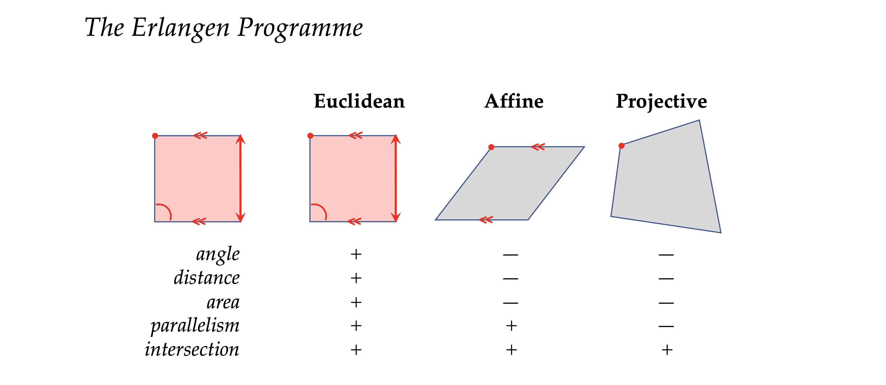

# What Geometric Deep Learning is all about?

**Gist:** Fundamental Principles underlying Deep Representation Learning architectures.
Single word to convey gist of the course: **Symmetry**

> Symmetry, as wide or as narrow as you may define its meaning, is **one idea** by which man through the ages has tried to comprehend and create order, beauty and perfection.	**H. Weyl 1952**

# Historical background

The term **symmetry** has **greek** origin (_συμμετρία_). Symmetry literally translates as **same measure** and ancient greeks used this term to somehow **vaguely** convey the the **beauty** of proportion in arts and **harmony**.

**Plato** considered the **five regular polyhedra** (~370 BC) what we now call the **platonic solids**.  Originally thought as fundamental must be **building blocks** that shape the physical world. This idea was not very far from the truth. **Kepler** many centuries after attempted a rigorous analysis of the symmetry. He was in particular concerned with the symmetric shape of **water crystals** and he wrote a book titled **“On the six-cornered snowflake”** (1611)

Nowadays known as **hexagonal packing of particles**. It was an idea that clearly preceded the understanding of **how matter is formed** and the concept of atoms, molecules and crystals. It holds today as the basis of modern **crystallography**.

**Modern geometry** is also traced back to ancient greece and the seminal work of **Euclide's elements**.

## Euclidean geometry

> In a plane, given a line and a point not on it, at most one line parallel to the given line can be drawn through the point.	**Euclide (~300 BC)**

This type of geometry was the only one known for **over 2000 years**. At the **core** of euclidean geometry was a set of **5 basic assumptions**, or how Euclide called them, **postulates** that he used to derive certain **properties** and **prove** results. For hundred of years the **fifth postulate** of Euclidian geometry is stating that:

> It's possible to pass only **one line parallel** to a given line through a point that lies outside of it.

 This fifth postulate posteriorly defined any **attempt** to try to **prove it** from **other** postulates of geometry.

## End of Euclid’s Monopoly

In the **19th** the Euclidian monopoly came to an end. The 19 th century was really a remarkable burst of creativity that made **geometry** into probably one of the most exciting fields of mathematics.
**First** it was the development of what is called **projective geometry** (J. V. Poncelet **1822**).
**No exists notion of parallelism**: In projective geometry, **points** and **lines** are **interchangeable** and there is **no** such thing as **parallelism**. Any two lines **intersect** at one exactly **point**.
Nowadays it's very popular in **computer graphics**.
**Non considered non-euclidian geometry strictly**. But it was probably the first one to undermine this euclidian concept of **parallelism**.

### Hyperbolic Geometry

**First published construction of a non-euclidian geometry**
Is credited to **N. Lobachevsky** (1826), a russian mathematician that considered the fifth axiom of euclidian geometry a completely **arbitrary limitation**. 

> In geometry I find certain imperfections which I hold to be the reason why this science [...] can as yet make no advance from that state in which it came to us from Euclid. As belonging to these imperfections, I consider [...] the momentous gap in the theory of parallels, to fill which all efforts of mathematicians have so far been in vain. **N. Lobachevsky 1826** 

**Alternative proposed**
**Postulate:** **More** than **one** line can pass through a **point** that is **parallel** to a given one. Such construction required a **space** with **negative curvature**. This type of space is now called a **hyperbolic space**.

**Academia rejection to the proposal**
This idea was so **unconventional** and **theoretical** at the time of the publication that he was openly derided by colleagues at his university for writing and publishing such nonsense. Some mathematicians of his time said that this was at the level of some **school teacher** not a universitary professor.

**Different persons came to the same idea from differents backgrounds**
**J. Bolyai** (1832), an hungarian mathematician apparently came to the same ideas together with Lobachevsky.
> I have discovered such wonderful things that I was amazed...out of nothing I have created a strange new universe. — **Jánus Bolyai to his father**

> To praise it would amount to praising myself. For the entire content of the work...coincides almost exactly with my own meditations [in the] past thirty or thirty-five years.” — **Gauss to Farkas Bolyai**

### Riemann (Differential) Geometry

> **Manifolds** in which, as in the plane and in space, the line-element may be reduced to the form,
> $$
> \sqrt{\sum{dx^2}}
> $$
> are therefore only a particular case of the manifolds to be here investigated; they require a special name, and therefore these manifolds in which the square of the line-element may be expressed as the sum of the squares of complete differentials I will call **flat**.” **Riemann**

**Last nail in euclid's coffin**
**Gauss's** own Ph.D student **Bernard Riemann**. In his lecture on the hypothesis on which geometry is based, he basically formulated what is nowadays called **differential geometry of surfaces**.

**Euclidian geometry second axiom doesn't hold**
He also constructed **non-euclidian geometry** on the **sphere**, that is sometimes called the **Riemann Geometry** in the narrow sense, and in this case the **fifth postulate** doesn't hold as well as in the construction of **Lobachevsky**, **BUT** also the **second** postulate doesn't hold.
**Second postulate**: All straight lines can be **continued indefenitely**.
On the **sphere** all straight lines have **finite** lengths.

**Entire zoo of different geometries emerged**

Towards the end of the **1800s** these geometries became **non-unified** fields. Mathematicians were **debating** which geometry is the **right** one and **WHAT** actually defines the geometry.

### WHAT actually defines geometry? The Erlangen Programme

> Given a [homogeneous] manifold and a transformation group acting [transitively] on it, to investigate those properties of figures on that manifold which are invariant under transformations of that group. **F. Klein 1872**

**Erlangen Programme**
Klein proposed a very **radical** approach of **treating** geometry as the **study of invariants** and **symmetries**. These are the **properties** that remain **unchanged** under some class of **transformation**. This approach immediately created clarity by showing that **different** geometries could be defined by an appropriated choice of **symmetry**.

**Example**: 
Euclidian geometry are **rigid motions**. These are **translations, reflections and rotations** that **preserves** properties such as **angles, distances, areas, parallelism of lines and their intersections**.

**The language of group theory as the language to formalize the notion of symmetry**
Group theory was also a shiny mathematical field that was born in the **19th** century and the term group was first used by **E. Galois** (1832).

### Influence to other fields

These ideas of symmetry on geometry were very profound and it also spilled into other fields, in particular in **physics**. 
> Every [**differentiable**] symmetry of the action of a physical system [with conservative forces] has a corresponding conservation law. **E. Noether 1918**

E. Noether, she was Klein's colleagues in Gothengen, she **proved** that every differentiable symmetry of the action of a physical system **has a corresponding conservation law**. By all means this was a really **stunning result** because beforehand you had to do **very detailed** materials **experimental** observations to discover fundamental laws such as **conservation of energy**. So you would measure the energy in many experiments and you will see that up some small **errors** the energy remains the same. It was an **empirical result** not coming from anywhere. 
**Noether's theorem** established is that the conservation of energy emerges from translational symmetry of time. So it's rather **intuitive** idea that the results of an experiment would be the same if you did it yesterday, today or if you do it tomorrow.

### Gauge Invariance

**H. Weyl** cited his poetic definition of symmetry. He used these ideas to develop the concept of what he called **Gauge Invariance**. It was a principle from which **electromagnetism** could be **derived**. He also speculated that he tried to unify with gravitation 

### Standar model in particle physics

After several decades **non-abelian gauge theory**, it was finally possible in a theory that was developed by **Yang** & **Mills** in **1954** to provide a **unified frameword** that describes all the fundamental forces of nature, with the exception of gravity. This is what is called the standard model in the particle physics and it unifies the description of electromagnetism, weak interactions and strong interactions. All of this using the **language** of **group theory** and **gauge invariance**.

> Unification of electromagnetic and weak forces (modelled with the groups U(1) × SU(2)) and the strong force (based on the group SU(3)) **C. N. Yang** & **R. L. Mills 1954**

> It is only slightly overstating the case to say that Physics is the study of **symmetry**. **P. Anderson 1972**

**Interesting resource on the topic of symmetry in physics** (Roger Penrose)
[Fearful Symmetry: The Search for Beauty in Modern Physics](https://www.amazon.com/Fearful-Symmetry-Physics-Princeton-Science-ebook/dp/B0147EPTRI)
If you were to distill these thousand plus pages into one word, it would be **symmetry**. He devotes a lot of time to **group theory** to the concepts of **symmetry** and how they are fundamental in physics.

