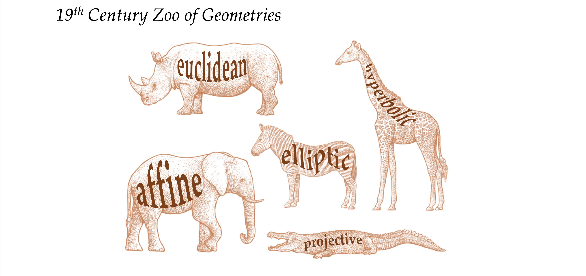
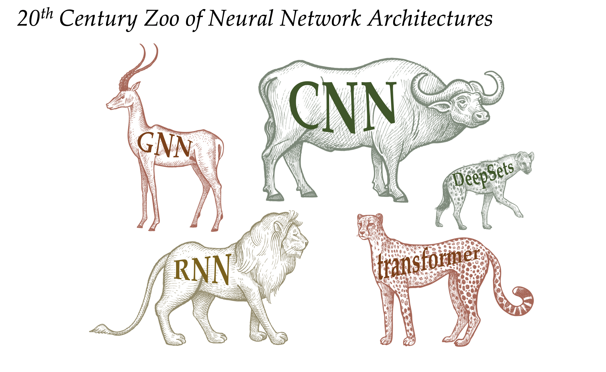
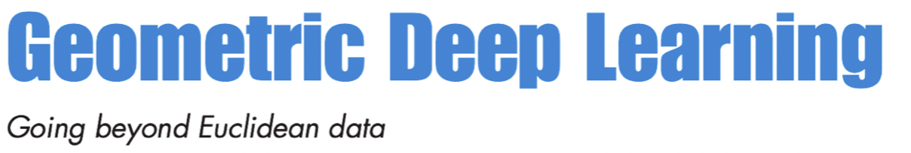
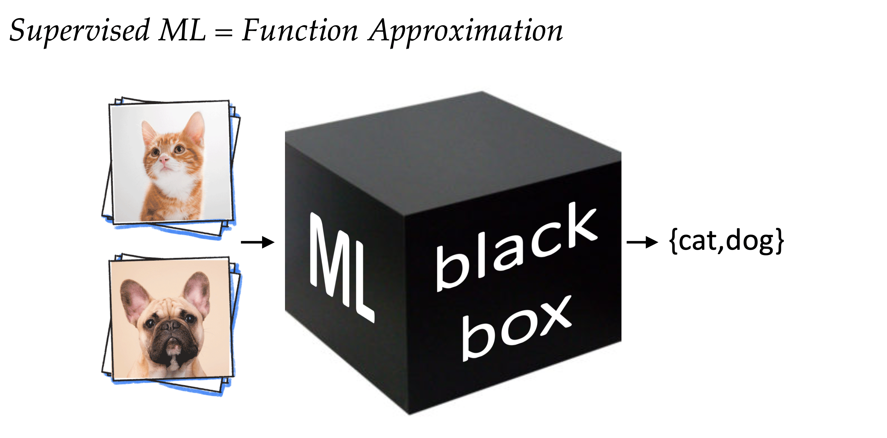
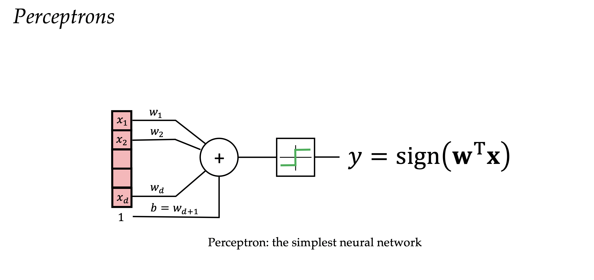
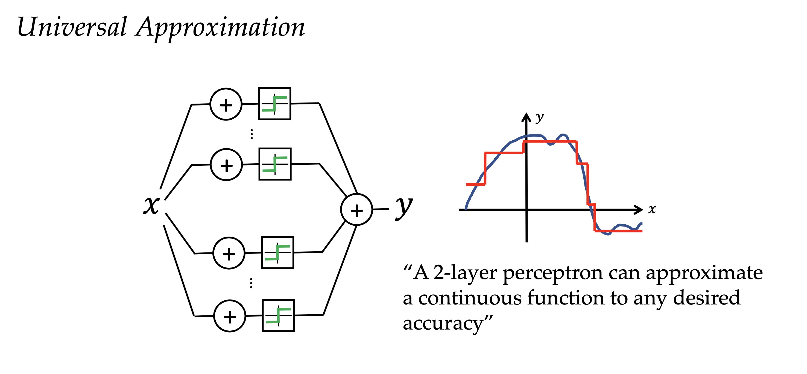
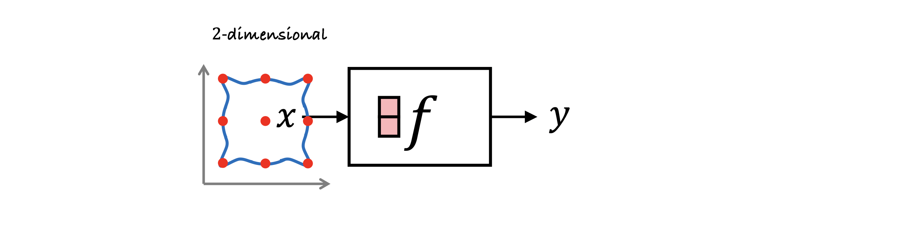
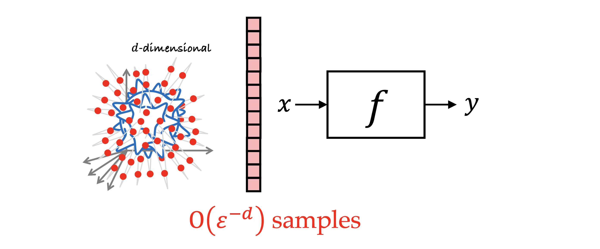

# What Geometric Deep Learning is all about?

**Gist:** Fundamental Principles underlying Deep Representation Learning architectures.
Single word to convey gist of the course: **Symmetry**

> Symmetry, as wide or as narrow as you may define its meaning, is **one idea** by which man through the ages has tried to comprehend and create order, beauty and perfection.	**H. Weyl 1952**

# Historical background

The term **symmetry** has **greek** origin (_συμμετρία_). Symmetry literally translates as **same measure** and ancient greeks used this term to somehow **vaguely** convey the the **beauty** of proportion in arts and **harmony**.

**Plato** considered the **five regular polyhedra** (~370 BC) what we now call the **platonic solids**.  Originally thought as fundamental must be **building blocks** that shape the physical world. This idea was not very far from the truth. **Kepler** many centuries after attempted a rigorous analysis of the symmetry. He was in particular concerned with the symmetric shape of **water crystals** and he wrote a book titled **“On the six-cornered snowflake”** (1611)

Nowadays known as **hexagonal packing of particles**. It was an idea that clearly preceded the understanding of **how matter is formed** and the concept of atoms, molecules and crystals. It holds today as the basis of modern **crystallography**.

**Modern geometry** is also traced back to ancient greece and the seminal work of **Euclide's elements**.

## Euclidean geometry

> In a plane, given a line and a point not on it, at most one line parallel to the given line can be drawn through the point.	**Euclide (~300 BC)**

This type of geometry was the only one known for **over 2000 years**. At the **core** of euclidean geometry was a set of **5 basic assumptions**, or how Euclide called them, **postulates** that he used to derive certain **properties** and **prove** results. For hundred of years the **fifth postulate** of Euclidian geometry is stating that:

> It's possible to pass only **one line parallel** to a given line through a point that lies outside of it.

 This fifth postulate posteriorly defined any **attempt** to try to **prove it** from **other** postulates of geometry.

## End of Euclid’s Monopoly

In the **19th** the Euclidian monopoly came to an end. The 19 th century was really a remarkable burst of creativity that made **geometry** into probably one of the most exciting fields of mathematics.
**First** it was the development of what is called **projective geometry** (J. V. Poncelet **1822**).
**No exists notion of parallelism**: In projective geometry, **points** and **lines** are **interchangeable** and there is **no** such thing as **parallelism**. Any two lines **intersect** at one exactly **point**.
Nowadays it's very popular in **computer graphics**.
**Non considered non-euclidian geometry strictly**. But it was probably the first one to undermine this euclidian concept of **parallelism**.

### Hyperbolic Geometry

**First published construction of a non-euclidian geometry**
Is credited to **N. Lobachevsky** (1826), a russian mathematician that considered the fifth axiom of euclidian geometry a completely **arbitrary limitation**. 

> In geometry I find certain imperfections which I hold to be the reason why this science [...] can as yet make no advance from that state in which it came to us from Euclid. As belonging to these imperfections, I consider [...] the momentous gap in the theory of parallels, to fill which all efforts of mathematicians have so far been in vain. **N. Lobachevsky 1826** 

**Alternative proposed**
**Postulate:** **More** than **one** line can pass through a **point** that is **parallel** to a given one. Such construction required a **space** with **negative curvature**. This type of space is now called a **hyperbolic space**.

**Academia rejection to the proposal**
This idea was so **unconventional** and **theoretical** at the time of the publication that he was openly derided by colleagues at his university for writing and publishing such nonsense. Some mathematicians of his time said that this was at the level of some **school teacher** not a universitary professor.

**Different persons came to the same idea from differents backgrounds**
**J. Bolyai** (1832), an hungarian mathematician apparently came to the same ideas together with Lobachevsky.
> I have discovered such wonderful things that I was amazed...out of nothing I have created a strange new universe. — **Jánus Bolyai to his father**

> To praise it would amount to praising myself. For the entire content of the work...coincides almost exactly with my own meditations [in the] past thirty or thirty-five years.” — **Gauss to Farkas Bolyai**

### Riemann (Differential) Geometry

> **Manifolds** in which, as in the plane and in space, the line-element may be reduced to the form,
> $$
> \sqrt{\sum{dx^2}}
> $$
> are therefore only a particular case of the manifolds to be here investigated; they require a special name, and therefore these manifolds in which the square of the line-element may be expressed as the sum of the squares of complete differentials I will call **flat**.” **Riemann**

**Last nail in euclid's coffin**
**Gauss's** own Ph.D student **Bernard Riemann**. In his lecture on the hypothesis on which geometry is based, he basically formulated what is nowadays called **differential geometry of surfaces**.

**Euclidian geometry second axiom doesn't hold**
He also constructed **non-euclidian geometry** on the **sphere**, that is sometimes called the **Riemann Geometry** in the narrow sense, and in this case the **fifth postulate** doesn't hold as well as in the construction of **Lobachevsky**, **BUT** also the **second** postulate doesn't hold.
**Second postulate**: All straight lines can be **continued indefenitely**.
On the **sphere** all straight lines have **finite** lengths.

**Entire zoo of different geometries emerged**

Towards the end of the **1800s** these geometries became **non-unified** fields. Mathematicians were **debating** which geometry is the **right** one and **WHAT** actually defines the geometry.

### WHAT actually defines geometry? The Erlangen Programme

> Given a [homogeneous] manifold and a transformation group acting [transitively] on it, to investigate those properties of figures on that manifold which are invariant under transformations of that group. **F. Klein 1872**

**Erlangen Programme**
Klein proposed a very **radical** approach of **treating** geometry as the **study of invariants** and **symmetries**. These are the **properties** that remain **unchanged** under some class of **transformation**. This approach immediately created clarity by showing that **different** geometries could be defined by an appropriated choice of **symmetry**.

**Example**: 
Euclidian geometry are **rigid motions**. These are **translations, reflections and rotations** that **preserves** properties such as **angles, distances, areas, parallelism of lines and their intersections**.

**The language of group theory as the language to formalize the notion of symmetry**
Group theory was also a shiny mathematical field that was born in the **19th** century and the term group was first used by **E. Galois** (1832).

### Influence to other fields

These ideas of symmetry on geometry were very profound and it also spilled into other fields, in particular in **physics**. 
> Every [**differentiable**] symmetry of the action of a physical system [with conservative forces] has a corresponding conservation law. **E. Noether 1918**

E. Noether, she was Klein's colleagues in Gothengen, she **proved** that every differentiable symmetry of the action of a physical system **has a corresponding conservation law**. By all means this was a really **stunning result** because beforehand you had to do **very detailed** materials **experimental** observations to discover fundamental laws such as **conservation of energy**. So you would measure the energy in many experiments and you will see that up some small **errors** the energy remains the same. It was an **empirical result** not coming from anywhere. 
**Noether's theorem** established is that the conservation of energy emerges from translational symmetry of time. So it's rather **intuitive** idea that the results of an experiment would be the same if you did it yesterday, today or if you do it tomorrow.

### Gauge Invariance

**H. Weyl** cited his poetic definition of symmetry. He used these ideas to develop the concept of what he called **Gauge Invariance**. It was a principle from which **electromagnetism** could be **derived**. He also speculated that he tried to unify with gravitation 

### Standar model in particle physics

After several decades **non-abelian gauge theory**, it was finally possible in a theory that was developed by **Yang** & **Mills** in **1954** to provide a **unified framework** that describes all the fundamental forces of nature, with the exception of gravity. This is what is called the standard model in the particle physics and it unifies the description of electromagnetism, weak interactions and strong interactions. All of this using the **language** of **group theory** and **gauge invariance**.

> Unification of electromagnetic and weak forces (modelled with the groups U(1) × SU(2)) and the strong force (based on the group SU(3)) **C. N. Yang** & **R. L. Mills 1954**

> It is only slightly overstating the case to say that Physics is the study of **symmetry**. **P. Anderson 1972**

**Interesting resource on the topic of symmetry in physics** (Roger Penrose)
[Fearful Symmetry: The Search for Beauty in Modern Physics](https://www.amazon.com/Fearful-Symmetry-Physics-Princeton-Science-ebook/dp/B0147EPTRI)
If you were to distill these thousand plus pages into one word, it would be **symmetry**. He devotes a lot of time to **group theory** to the concepts of **symmetry** and how they are fundamental in physics.

# What does the historical background all have to do with Deep Learning?

The current state of affairs in the field of Deep Learning reminds a lot of the situation of **geometry** in the **19th** century. In the past decade Deep Learning has brought a true revolution in the data science world. It made **possible** many tasks that previously maybe **20 years ago** would be considered nearly **science fiction**. Whether it's **computer vision** that powers **autonomous driving**, **speech recognition** behind every single mobile phone today, **natural language translation** sometimes **trained without supervision**, **playing** intelligent **games** like **go** or doing **science** tasks as solving the **protein folding** problem.

So, on the other hand we **nowadays** have this **zoo** of different **neuronal network architectures** for different types of **data** but very **few unifying principles**. As a consequence it's **difficult** to **understand** the **relations** between different methods and this **inevitably leads** to the **reinvention** and **rebranding** of the same concepts.

The **same ideas** are presented and published several times in **different communities** under **different names**. Sometimes it also brings unpleasant and bitter fights over **priority**, so this is really an **unhealthy** situation.

## The Erlangen Programme of ML: Geometric Deep Learning

We need some form of **unification** and we want to do it in the spirit of the **erlangen programme**.
This is what we call **Geometric Deep Learning** and it serves **2 purposes**:

1. **Pedagogical perspective**: It provides a **common** mathematical **framework** to study the most successful neuronal architectures that are currently used ubiquitously in the field of Deep Learning or Deep **representation** Learning.
2. **Constructive procedure to incorporate prior knowledge into neural networks**: Build **future** architectures in a **principled** way.

Question: **What will be after Deep Learning** or maybe beyond learning by **backpropagation**?
Answer: The hope is that these principles will **outlast** their particular implementations.

Question: When did this theory born?

Answer: The term [Geometric Deep Learning](https://geometricdeeplearning.com) was popularised in a **2017** paper in the **IEEE** _Single Processing_ magazine. Co-Authorised by [Michael M. Bronstein](https://twitter.com/mmbronstein?lang=en) and [Joan Bruna](https://arxiv.org/search/cs?searchtype=author&query=Bruna%2C+J).

Most recently the theory has been extended, to the length of approximately a **book**, and refined with the help of new contributors such as [Taco Cohen](https://tacocohen.wordpress.com) and [Petar Veličković](https://petar-v.com). The new paper is available **online**.

# Motivation

 **Where** actually **symmetry** and **how** exactly it is **manifested** in Machine Learning and **why** it is important?

If we consider the **simplest** setting of machine learning, **supervised learning**, this is essentially a **glorified function estimation** problem. 
**Problem description**: We're given some **unknown** function and we **observe** its **output** on what is called a **training set**. What we try to **do** is to **find** a **function** that **fits** well the **training data** while keeping **generalization** properties.
This function **comes** from some **class of functions**, some **hypothesis class**, and this way we try to **predict** outputs on previously **unseen inputs**, the so called the **test set**.

## Learn to discriminate dogs from cats via Supervised Learning

The typical example that is given is **image classification** where you have a **set of dog** and **cat set** images and it's a **binary classification**. This means that given any possible input image, assumed that it contains a cat or a dog, the function would classify them into class of cats or dogs.

Question: **What happened over the past decade?**

**2 trends** coincided:

1. **Availability of large and high quality data sets**: For example data sets such as [Imagenet](https://www.image-net.org) that has millions of **labeled** images.
1. **Sufficient computational resources**: The continuous improvements and development of **GPUs**, that were thought and originated as **g**raphics hardware, are especially well suitable for general purpose computations that you encounter in deep learning and AI in general (**array programming**).

These two trends have led to the design of **rich function classes** that have the capacity, at least in **theory**, to **interpolate** such large datasets.

## Perceptron

**Neural Networks are a suitable choice to represent functions**.

Neural networks of course are **not new at all**. They are at least **70 years** old, so the first works are from the **50s** and  with a very **simple** choice of **architecture**, the so called **perceptron**. This type of architecture is probably the earliest and **simplest** neural network.

## Universal Approximation

We can show that if we **connect** just **2 layers** of such networks, **perceptron**, what is called **multi-layer perceptron** or a perceptron with one **hidden layer**, it produces a **dense** class of functions.
In other words, we can **approximate any continuous function** or even broader class of functions to **any** desired **accuracy**. We call this **property** universal approximation.
It is a very **general** architecture than can **represent** practically **anything**.

### Kolmogorov–Arnold representation theorem: Model as a form of Artificial Intelligence

At the second [International Congress of Mathematicians](http://en.wikipedia.org/wiki/International_Congress_of_Mathematicians) in Paris 1900, [Hilbert](http://en.wikipedia.org/wiki/David_Hilbert) presented ten of his [23 problems](http://en.wikipedia.org/wiki/Hilbert's_problems), including the [13th problem](http://en.wikipedia.org/wiki/Hilbert's_thirteenth_problem) about equations of degree seven. He considered the following equation,
$$
x^7+ax^3+bx^2+cx+1=0,
$$
and asked whether its solution $x(a,b,c)$, seen as a function of the three parameters a, b and c, can be written as the **composition** of functions of only two variables.

**Hilbert's 13th problem statement**: _Solve 7th degree equation using algebraic (variant: continuous) functions  of two parameters_.

**Kolmogorov-Arnold representation theorem**:
The model assumes that an output parameter $$z$$ depends on vector input parameters $$x$$. Kolmogorov-Arnold formal model requires the continuity, but we relax this condition and assume that small increments in the inputs are causing small differences in the output.
$$
z = F(x_1,x_2,...,x_n) \\
z \: + \Delta z =  F(x_1 \: + \Delta x_1,x_2 \: + \Delta x_2,...,x_n \: + \Delta x_n \\
z = \sum_{k=1}^{2n+1}\Phi_{k}\Bigg[ \sum_{j=1}^{n} f_{k,j}(x_{j})\Bigg]
$$

The model itself is a set of unspecified functions.

Let $$f \: [0,1]^{d} \mapsto \mathbb{R}$$ be continuous. There exists **univariate** continuous functions $$g_{q}, \Psi_{p,q}$$, such that $$f(x_{1},...,x_{d}) = \sum_{q=0}^{2d}g_{q} \Big ( \Psi_{p,q}(x_{p})\Big)$$ 
Nowadays there are better representations than the one exposed here. There are **3** main reasons why there are no explicit formulas for $$g_{q}, \Psi_{p,q}$$.

1. The proofs of these theorems are **non-constructive**.
2. The **outer function**, $$g_{q}$$ highly depends on $$f$$ so we can't just choose one.
3. The **inner function**  $$\Psi_{p,q}$$ is continuous.

***NOTE***: THE THEOREM ONLY STATES EXISTENTS OF THESE FUNCTIONS.

This form has **similarities** with a **2-layered** neural network but this is highly debated.

**e.g:** The function,
$$
f_{1}(x_1,x_2) = x_{1}^{2} \: + x_{2}
$$
can be decomposed as in the theorem since it's a summation of continuous univariate functions. Let
$$
g_{1}(x) = x \:, \Psi_{1,1}(x_1) = x_{1}^2 \:, \Psi_{2,1}(x_2) = x_2
$$
and for all the other functions to be set with $$g_q = \Psi_{p,q} =0$$.

## The Curse of Dimensionality

This is a very well studied problem in **approximation theory** and in **low dimensions** we have a lot of results that tell us exactly how the **error** will behave. An example of these behaviours could be **how** the error would occur if we **sample** our data in a certain way. It has been studied very extensively over the **past century** or even more but the situation appears to be **absolutely** different in **high dimensions**. 
Even if we pick a very nice class of functions of the so called **lipschitz continuous functions**.

What we will find out very quickly that as the **dimensionality** of this **space**, the unit cube, grows then the **number of samples** grow **exponentially**. This phenomenon is colloquially known as the curse of dimensionality. Modern machine learning methods need to operate with data not in two or three dimensions but in **thousands** or even **millions** dimensions. **Images** can serve as an illustrative example of very high dimensional input space.

The curse of dimensionality is simply an inevitable God's curse accompanying every machine learning problem. Therefore the previous exposed naive approach to learning is completely impossible to achieve.

This is probably best seen in **computer vision** applications like **image classification**. Since images are well known as high dimensional input space, even for example tiny images from [MNIST data set](http://yann.lecun.com/exdb/mnist/), they are almost thousand dimension. But if we look deeper at this problem, intuitively we see that there is a lot of **structure**.
